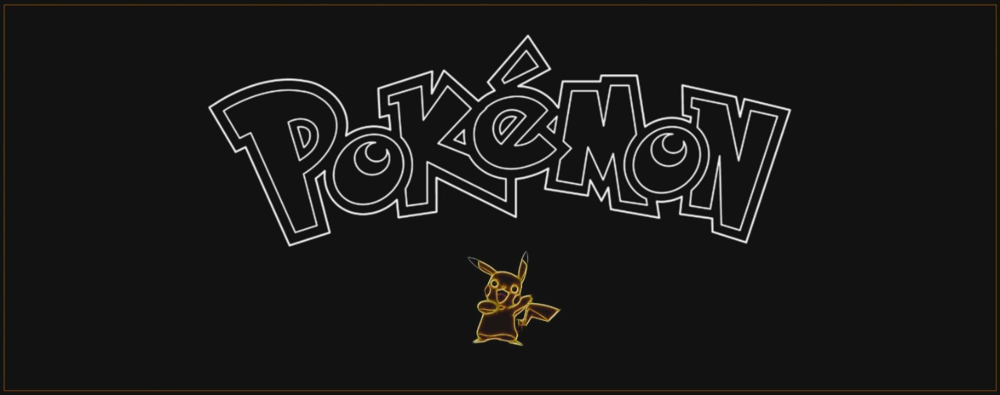
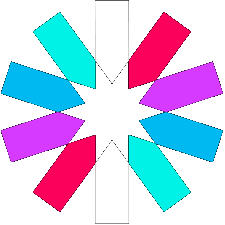
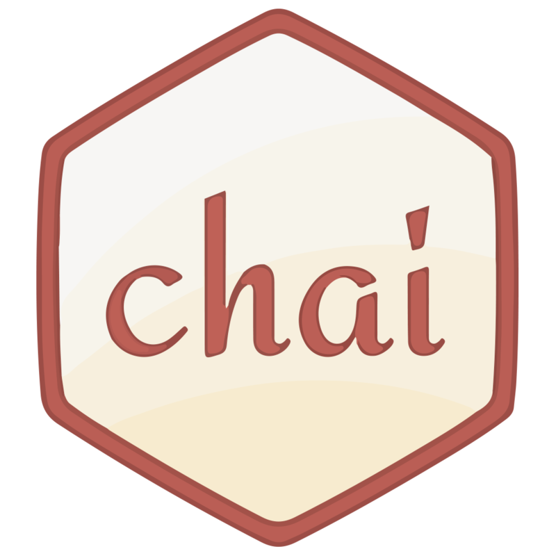

# :construction: Projeto API de Pokémon :cyclone:

 

<h2>Índice</h2>

 :round_pushpin: [Sobre](#sobre) 
 :round_pushpin: [Tecnologias](#tecnologias) 
 :round_pushpin: [Decisões](#decisoes) 
 :round_pushpin: [Orientações](#orientacoes) 
 :round_pushpin: [Testes](#testes) 
 :round_pushpin: [Usabilidade](#usabilidade) 
 :round_pushpin: [Documentação](#documentacao) 
 :round_pushpin: [Referências](#referencias) 
 
<h2 id="sobre">Sobre</h2>

#### Este projeto é uma aplicação em `Node.js` usando o pacote `Sequelize` para fazer um CRUD de Pokémons :fire:

Foi desenvolvida uma API seguindo os princípios do REST e que conecta ao banco de dados `postgreSQL` através do [Supabase](https://supabase.com/).
Para acessar a API, é necessário que a pessoa usuária faça login com suas credencias e isso será autenticado e autorizado via JWT com a geração de token.

A [documentação](#documentacao) te ajudará a entender o projeto com maior clareza e assertividade :book:
 
<h2 id="tecnologias">Tecnologias</h2>

  
  
  
  
  
  
   
   
   

<h2 id="decisoes">Decisões</h2>

  [ESLint](https://eslint.org/)

- O projeto possui regras estritas de ESLint (Airbnb) para JavaScript onde é possível encontrar e corrigir problemas, seguindo boas práticas e padronização.

 [Docker](https://www.docker.com/)

- Utilizar imagens Docker para empacotar toda a aplicação e suas dependências, torna a distribuição mais fácil, segura e padronizada.

 [Sequelize](https://sequelize.org/)

- Como uma das bibliotecas de ORM mais conhecidas, o Sequelize foi utilizado nesse projeto pois o código se torna mais legível, extensível e de fácil manutenção.

 [JWT](https://jwt.io/)

- Os JSON Web Tokens representam a autenticação e autorização de forma eficaz e simples.

<h2 id="orientacoes">Orientações</h2>

<strong>:closed_lock_with_key: Arquivos example.env e .env</strong>
 
  
> :information_source: Você encontrará um arquivo `example.env` onde estarão as variáveis de ambiente utilizadas no projeto, duplique-o e renomeie-o apenas para `.env` e insira os valores nas variáveis de ambiente conforme sua utilização.
 
  

<strong>:whale2: Rodando com Docker x Localmente</strong>

### 👉 Com Docker

> :information_source: Rode os serviços `node` e `db` com o comando `docker-compose up -d`.

- Lembre-se de parar o `postgresql` se estiver usando localmente na porta padrão (`5432`), ou adapte o docker-compose caso queria fazer uso da aplicação em containers;

- Esses serviços irão inicializar um container chamado `blogs_api` e outro chamado `blogs_api_db`;

- A partir daqui você pode acessar o container `blogs_api` via CLI ou abri-lo no seu editor;

> :information_source: Use o comando `docker exec -it blogs_api bash`.

- Ele te dará acesso ao terminal interativo do container criado pelo docker-compose, que está rodando em segundo plano.

> :information_source: Ao rodar o docker-compose, ele automaticamente irá rodar os seguintes comandos:

- `npm install`: Irá instalar todas as dependências;

- `npm start`: Irá rodar a aplicação na porta `3000` pelo `nodemon`, ou adapte o docker-compose e o `.env` caso sinta necessidade.

### 👉 Sem Docker

> :information_source: Instale as dependências com `npm install`.

> :information_source: Rode a aplicação com `npm start` na porta `3000` pelo `nodemon`, ou adapte o `.env` caso sinta necessidade.

<h2 id="testes">Testes</h2>

> :information_source:

<h2 id="usabilidade">Usabilidade</h2>

_Obs: Veja a seção de [documentação](#documentacao) para entender melhor como funcionam as rotas._

> :information_source: Após rodar a aplicação, você deverá acessar através de `http://localhost:{porta}/{rota}` 

- Algumas sugestões de clientes:

  :bulb: [HTTPie](https://httpie.io/) | :bulb: [Postman](https://www.postman.com/) | :bulb: [Insomnia](https://insomnia.rest/) | :bulb: [Thunder Client](https://marketplace.visualstudio.com/items?itemName=rangav.vscode-thunder-client)

<h2 id="documentacao">Documentação</h2>

> :information_source: Acesse [aqui](https://github.com/brenndha-cabral/blogs-api/wiki) a documentação deste projeto onde constam mais detalhes sobre os relacionamentos e entidades elaborados, arquitetura de software utilizada e as rotas possíveis para consumo.

<h2 id="referencias">Referências</h2>

> :information_source: Este projeto foi inspirado no teste para o cargo de Back-end da empresa [RedFox](https://www.linkedin.com/company/redfoxdigitalsolutions/?originalSubdomain=br). Para acessar o repositório original, clique [aqui](https://github.com/RedFoxTech/vaga-backend-teste).
